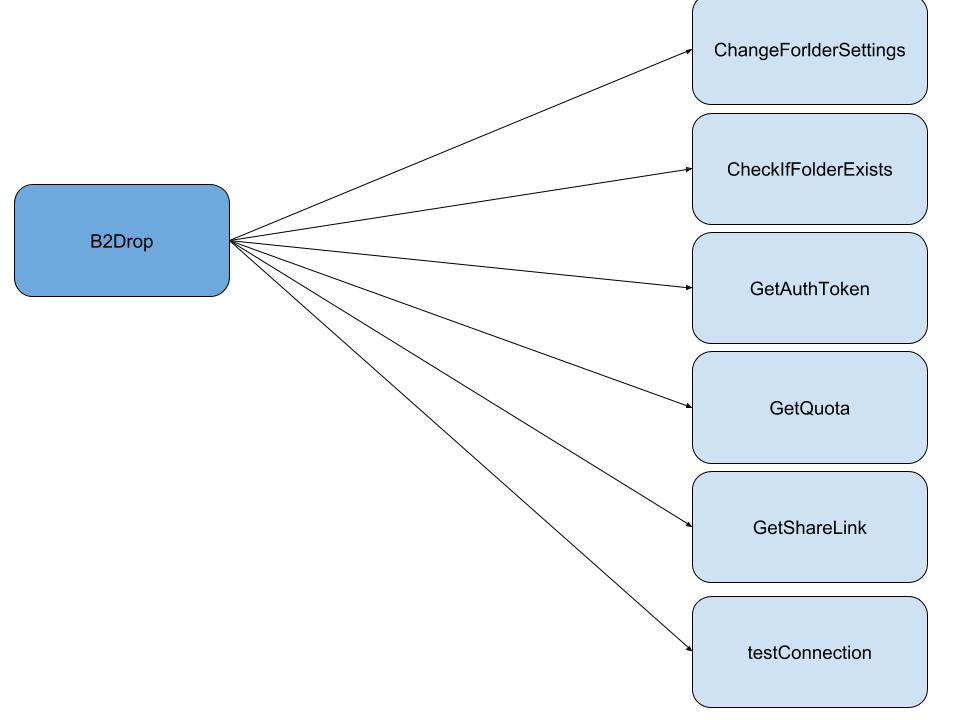
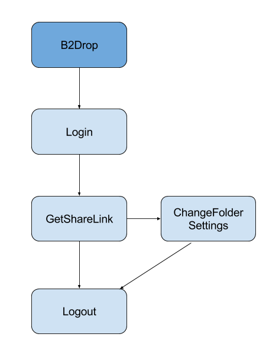
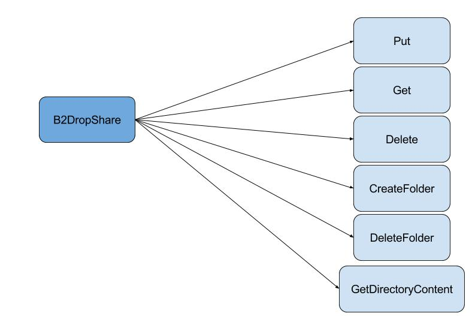
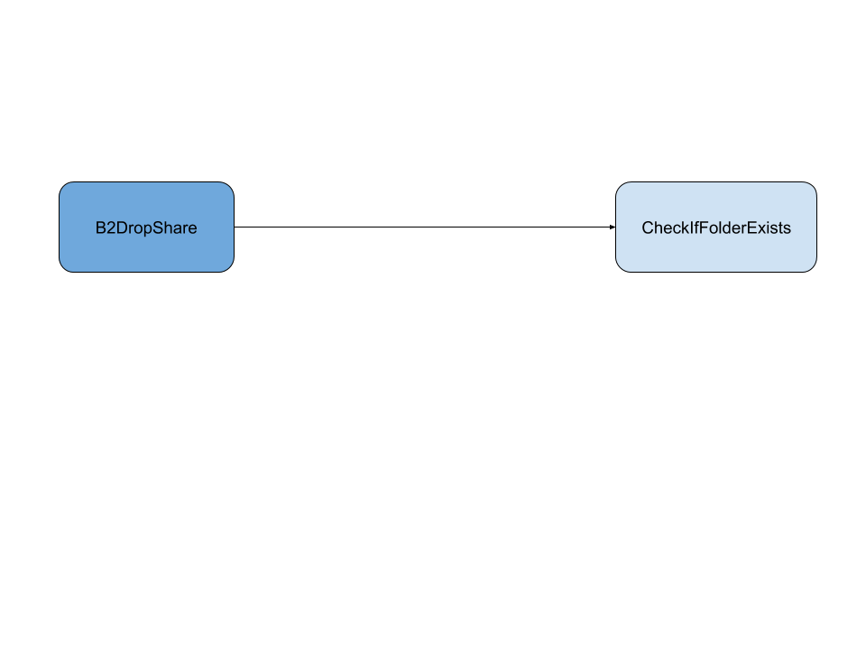

[](https://travis-ci.org/feup-infolab/node-b2drop)
[](https://www.codacy.com/app/silvae86/node-b2drop?utm_source=github.com&utm_medium=referral&utm_content=feup-infolab/node-b2drop&utm_campaign=badger)
[](https://www.codacy.com/app/silvae86/node-b2drop?utm_source=github.com&utm_medium=referral&utm_content=feup-infolab/node-b2drop&utm_campaign=Badge_Coverage)
[](https://badge.fury.io/js/%40feup-infolab%2Fnode-b2drop)
[](https://gitter.im/feup-infolab/dendro)


node-b2drop
====
NodeJS client for B2Drop, based on OwnCloud

# Table of Contents
  * [Installation](#installation)
  * [Module Details](#module-details)
    * [B2Drop](#b2drop)
    * [B2DropShare](#b2dropshare)
  * [Examples](#examples)

            
## Installation 

    $ npm i @feup-infolab/node-b2drop
    
## Module Details 
 ### Introduction
    
   The module is divides in two main classes  B2drop and B2ropShare, the main reason for that
    is to give the maximum flexibility using this cloud storage service.
 
 #### B2Drop
   
   B2Drop is responsible for all operations related to user private 
   area. This operations can be divided in two groups: WebDav  and 
   the functions to extend the previous group capabilities using requests.
   
   The WebDav functions group send the user and password on every request via https.
   
   The extended features uses request and requesttoken to validate the request.
   
   ##### WebDav
   
   
   ##### Extended Features
   
   
   ##### Methods
 - **`B2Drop(username, password)`** - Constructor
 - **`changeFolderSetting (folderUri, folderID, setting, callback)`** - Change folder setting (only change 1 setting for each call)
 - **`checkIfFolderExits (folderPath, callbakc) `** - Check if a folder exits in provided path
 - **`createFolder (folderUri, callback)`** - Create folder in folderUri
 - **`delete(fileUri, callback)`** - Delete file at fileUri
 - **`deleteFolder (folderUri, callback)`** - Delete folder in folderUri
 - **`get(fileUri, outputStream, callback)`** - Get file from fileUri
 - **`getAuthToken (callback)`** - get Authentication Token form B2drop website 
 - **`getDirectoryContents (folderPath, callback)`** - List folder content 
 - **`getQuota (callback) `** - Get available and used space in the cloud
 - **`getShareLink (folderUri, password, callback)`** - Create and get share link and set folder to editable and folder password  
 - **`put(fileUri, inputStream, callback)`** - Upload file to fileUri
 - **`testConnection (callback) `**- Simple test to check if username and password are valid
 
 ### B2DropShare
   
   B2DropShare is responsible for all operations related to users shared area, only uses WebDav.
   
   
   

   #### WebDav
 
  
  
     
   ##### Extended Features
   
   
   #### Methods
 - **`B2DropShare ( sharelink, password)`** - Constructor
 - **`createFolder(folderUri, callback)`** - Create folder in folderUri
 - **`checkIfFolderExits ( folderPath, callback)`**- Check if folder exists in provided path
 - **`delete(fileUri, callback)`** - Delete file at fileUri
 - **`deleteFolder(folderUri, callback)`** - Delete folder in folderUri
 - **`put(fileUri, inputStream, callback)`** - Upload file to fileUri
 - **`get(fileUri, outputStream, callback)`** - Get file from fileUri
 - **`getDirectoryContents(folderPath, callback)`** - List folder content
    
## Examples
 #### Create Share Link
   ```js
        const b2drop = require('node-b2drop').B2Drop;
        
        var account = new b2drop(b2dropAccount.username, b2dropAccount.password);
            account.getShareLink(testPathFolder1, passwordFolder, function (err, response, shareLink)
            {
                console.log(shareLink);
            };
});
   ```
  #### Upload File 
   ```js
         const b2drop = require('node-b2drop').B2Drop;
        
         var fileUri;
         var inputStream = fs.createReadStream(testFile.location);

         inputStream.on("open", function ()
            {
                var account = new b2drop(b2dropAccount.username, b2dropAccount.password);
                account.put(fileUri, inputStream, function (err)
                {
                  console.log(err);
                });
           }
});
  ```
   
## Test
    
    $ npm test

